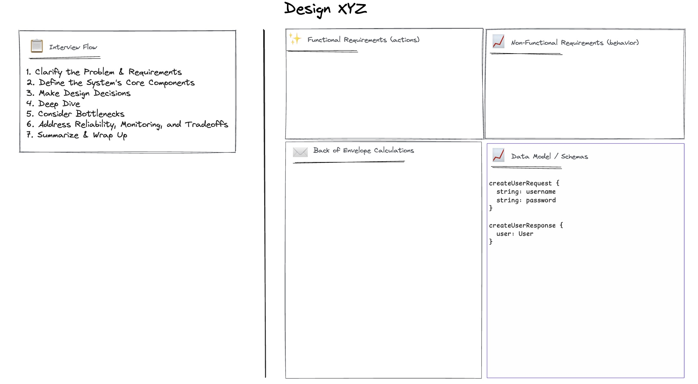
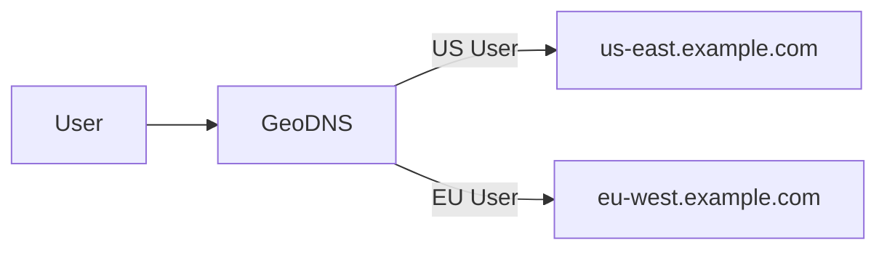
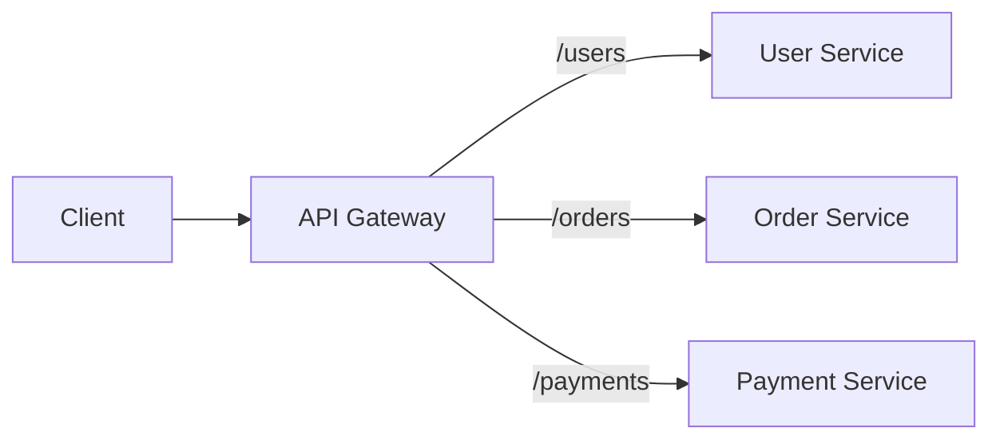
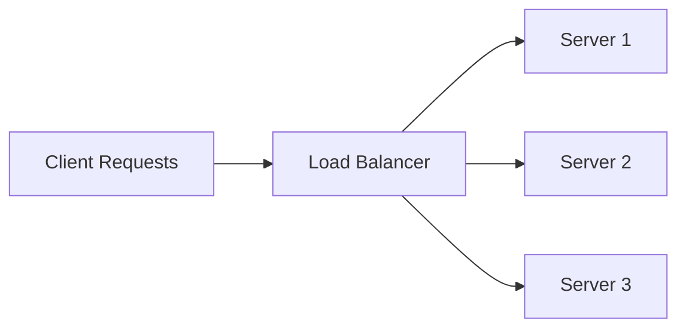
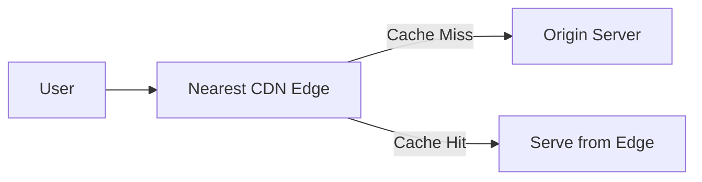
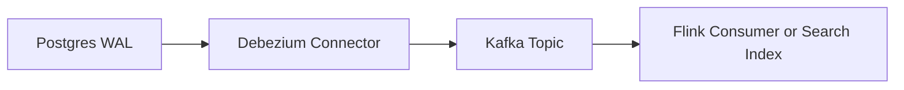
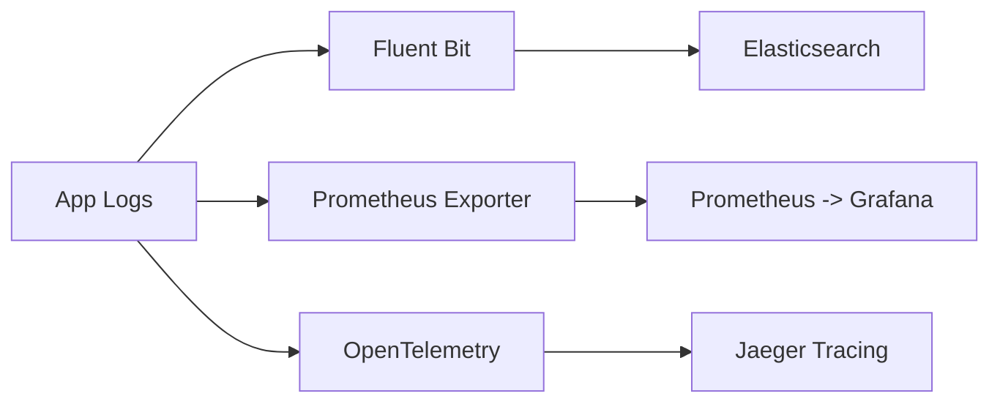
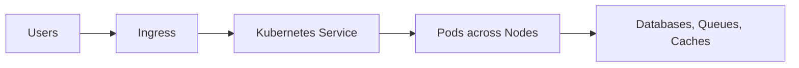

# System Design Template



Use this on https://excalidraw.com/

```bash
git clone git@github.com:wcygan/excalidraw-system-design-template.git
open https://excalidraw.com/
```

Then, on Excalidraw, do "Open → src/template.excalidraw"

## Libraries

Add these libraries by opening these URLs in new tabs:

- https://excalidraw.com/#addLibrary=https%3A%2F%2Flibraries.excalidraw.com%2Flibraries%2Frohanp%2Fsystem-design.excalidrawlib&token=HqeLsoxd84rC4CCQtr_Vu
- https://excalidraw.com/#addLibrary=https%3A%2F%2Flibraries.excalidraw.com%2Flibraries%2Fyouritjang%2Fsoftware-architecture.excalidrawlib&token=HqeLsoxd84rC4CCQtr_Vu

## Useful Concepts

### DNS (and GeoDNS)

Translates domain names to IPs and routes users to the closest data center using geolocation-based DNS responses.



### API Gateway

A single entry point that routes requests to microservices while handling authentication, logging, and request transformations.



### Authentication & Rate Limiting

Verifies user identity (e.g., JWT, API Keys) and limits excessive requests to prevent abuse.

```bash
# Example placeholders only — replace with your actual secrets securely
sk_live_your-stripe-key-here
hn_live_your-highnote-key-here
```

```bash
eyJhbGciOiJIUzI1NiIsInR5cCI6IkpXVCJ9.
eyJzdWIiOiIxMjM0NTY3ODkwIiwibmFtZSI6IkFsaWNlIEV4YW1wbGUiLCJyb2xlcyI6WyJ1c2VyIl0sImlhdCI6MTcxMDAwMDAwMCwiZXhwIjoxNzEwMDAzNjAwfQ.
TJVA95OrM7E2cBab30RMHrHDcEfxjoYZgeFONFh7HgQ

{
  "alg": "HS256",
  "typ": "JWT"
}

{
  "sub": "1234567890",
  "name": "Alice Example",
  "roles": ["user"],
  "iat": 1710000000,
  "exp": 1710003600
}
```

### Microservices & Data Model

e.g., gRPC with Protocol Buffers

```proto
syntax = "proto3";
service UserService {
  rpc GetUser(GetUserRequest) returns (UserResponse);
}
message GetUserRequest { string id = 1; }
message UserResponse { string id = 1; string name = 2; }
```

### Load Balancing

Distributes incoming requests across multiple servers to improve availability and performance.



### Caching

Stores frequently accessed data in-memory to reduce latency and database load.

```bash
SET user:123 '{"id":123,"name":"Alice"}'
GET user:123
```

### Relational Data Storage

Structured data stored in tables with ACID guarantees for consistency and transactions.

```sql
CREATE TABLE users (
  id SERIAL PRIMARY KEY,
  name TEXT,
  email TEXT UNIQUE
);
SELECT * FROM users WHERE id = 1;
```

### Partitioning (Within one database)

Purpose: Manage large tables

Splits large datasets (or tables) into smaller, more manageable pieces based on a logical key or time range, improving query performance and maintainability.

```sql
CREATE TABLE orders (
  id BIGSERIAL,
  region TEXT,
  created_at TIMESTAMP NOT NULL,
  amount DECIMAL
) PARTITION BY RANGE (created_at);
```

### Sharding (Across multiple databases)

Purpose: Scale horizontally

Distributes data across multiple databases (or clusters), each responsible for a subset of users or entities — enabling horizontal scalability and fault isolation.

The shard key determines where data lives (e.g., user_id % num_shards).

```java
int numShards = 4;
int shardId = userId % numShards;
String dbUrl = "jdbc:postgresql://db-shard-" + shardId + ".example.com/app";
Connection conn = DriverManager.getConnection(dbUrl);
```

### Idempotency

Ensures that repeating the same operation (due to retries or network failures) produces no unintended side effects — i.e., calling it once or multiple times has the same result.

### Deduplication

Removes or ignores duplicate messages or events that may be produced or received more than once in a distributed system.

### Workflow Orchestration

Coordinates and manages multi-step, long-running, or stateful business processes by defining workflows that execute, retry, and resume tasks reliably — even across failures.

```go
// workflow.go (Temporal Workflow)
func OrderWorkflow(ctx workflow.Context, orderID string) error {
    ao := workflow.ActivityOptions{
        StartToCloseTimeout: time.Minute,
        RetryPolicy: &temporal.RetryPolicy{MaximumAttempts: 3},
    }
    ctx = workflow.WithActivityOptions(ctx, ao)

    err := workflow.ExecuteActivity(ctx, ChargeCustomer, orderID).Get(ctx, nil)
    if err != nil {
        return err
    }

    err = workflow.ExecuteActivity(ctx, ShipOrder, orderID).Get(ctx, nil)
    if err != nil {
        return err
    }

    return workflow.ExecuteActivity(ctx, SendConfirmation, orderID).Get(ctx, nil)
}
````

### Object Storage

Stores large unstructured data (images, logs, backups) as immutable objects in buckets.

```bash
aws s3 cp photo.jpg s3://my-bucket/users/123/photo.jpg
```

### CDN

Caches static content at geographically distributed edge servers to reduce latency and offload origin servers.



### Blob Storage

Stores raw binary large objects (e.g., videos, ML models) optimized for throughput over latency.

```py
# Upload blob to Azure Blob Storage
from azure.storage.blob import BlobClient
blob = BlobClient.from_connection_string(conn_str, "data", "video.mp4")
with open("video.mp4", "rb") as f: blob.upload_blob(f)
```

### Change Data Capture

Tracks and streams database changes (inserts/updates/deletes) to downstream systems in real time.



### Stream Processing

Processes unbounded streams of events in real time with transformations, aggregations, and joins.

```java
DataStream<String> stream = env.fromSource(kafkaSource, WatermarkStrategy.noWatermarks(), "Kafka");
stream.map(event -> parse(event)).keyBy(User::getId).sum("amount");
```

### Batch Processing

Runs periodic jobs over large datasets for analytics, reports, or data warehousing.

```py
df = spark.read.parquet("s3://data/events/")
daily = df.groupBy("date").count()
daily.write.mode("overwrite").parquet("s3://reports/daily-counts/")
```

### Monitoring & Observability

- Logs (structured JSON)
- Metrics (latency, throughput, error rate)
- Traces (OpenTelemetry)
- Alerts (SLO/SLA thresholds)



### Compute Infrastructure

Provisioning and orchestration layer where services are deployed, e.g., Kubernetes clusters across multiple data centers.



#### Ingress

Routes external requests (via DNS/Load Balancer) into internal Kubernetes services securely.
